<!-- Every panel below is a self-hosted SVG in this repo. GitHub strips <script>
     and inline CSS from READMEs but renders SMIL / CSS-keyframe animation inside
     -embedded SVGs, so all the motion lives in the files themselves.
     Heatmap + stats are regenerated daily by .github/workflows/update-profile-art.yml;
     portrait + info card are static (scripts/README.md). -->

<h3><code>a1@github:~$ whoami</code></h3>

<table>
<tr>
<td valign="top"></td>
<td valign="top"></td>
</tr>
</table>

 

<h3><code>a1@github:~$ ./contributions.sh --graph</code></h3>

 
 

<h3><code>a1@github:~$ ./stats.sh</code></h3>

 
 

<h3><code>a1@github:~$ ls ~/building</code></h3>

<table>
<tr>
<td width="50%" valign="top">

**Enterprise CRM on Dynamics 365** 
One portal for 40+ branches across Saudi Arabia, China and Spain. Next.js front end on Dataverse, Microsoft Entra ID single sign-on, case management, a sales hub and live notifications. Replaced per-branch logins and took access outages to zero.

</td>
<td width="50%" valign="top">

**HireIQ, AI recruiting** 
Hiring built into the CRM: job publishing, CV intake and AI scoring of every candidate, with a background sweep that retries anything the model missed so no applicant is scored by a fallback.

</td>
</tr>
<tr>
<td valign="top">

**Internal AI platform on AWS Bedrock** 
Serves 200+ engineers and business users. Multi-layer model fallback, prompt caching and circuit breakers: 40% faster p95, 99.9% SLA, tracked on SLO dashboards.

</td>
<td valign="top">

**Saudi-dialect voice agents** 
Phone-grade voice AI on ElevenLabs that speaks Saudi Arabic from the first word, tested by scripted end-to-end calls before every release.

</td>
</tr>
<tr>
<td valign="top">

**Savvy / A1xOS** 
My own AI operating system: a voice assistant with a live HUD, and a Claude Code workspace of 150+ skills that reviews its own sessions and proposes its own upgrades.

</td>
<td valign="top">

**ERP automation** 
Dynamics 365 and n8n pipelines with idempotent integrations and automated reconciliation: order-to-invoice 25% faster, 150+ engineering hours a month back.

</td>
</tr>
</table>

 

<h3><code>a1@github:~$ ./stack.sh</code></h3>

 

<h3><code>a1@github:~$ ./links.sh</code></h3>

<b>Digital Transformation Manager · AI Engineer · Riyadh</b>

 

<b>a1@github:~$ cat experience.md</b>

 

**Digital Transformation Manager, MHG Trading CJSC** (2024 to present, Riyadh)

- Lead the company's digital transformation: enterprise CRM, AI platform, ERP automation
- Architected and run the internal AI platform on AWS Bedrock for 200+ users: 40% faster p95, 99.9% SLA
- Rolled out a single CRM portal with Entra ID SSO to 40+ branches in Saudi Arabia, China and Spain
- Took ERP integration failures to near zero across Dynamics 365 and n8n, adopted by 3 business units
- Built the release pipeline for a 6-engineer team: 8 major releases in 7 months, rollbacks down 60%

**Full-Stack Developer, MHG Trading CJSC** (2022 to 2024)

- Owned reliability of customer-facing Next.js and Laravel portals for 40+ branches at 99.9% uptime
- Ran $1M+/yr of payment processing on Stripe and PayPal with idempotent webhooks and reconciliation

**Web Developer, MHG Trading CJSC** (2021 to 2022)

- E-commerce platforms and CMS builds on PHP, Laravel and WordPress

**Education and certifications**

- BASc Business & IT, IU International University of Applied Sciences
- CS50 AI, HarvardX (2023)
- Project Management, Google (2024)
- Introduction to Microsoft Dynamics 365, Microsoft via Coursera (2025) · [verify](https://coursera.org/verify/SLYTIOO5TJJE)

